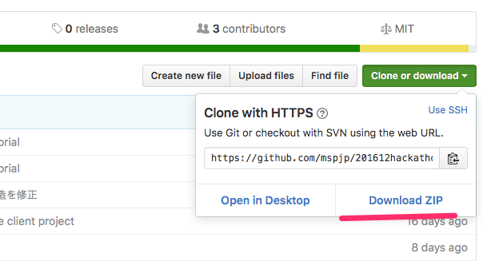

# 201612hackathonyokohama
2016年12月18日に行う予定の横浜ハッカソンのサンプルコードリポジトリです

## Windowsを使用している方
csharpフォルダの中を使用してください

## Macを使用している方
nodejsフォルダの中を使用してください

# リポジトリ構成

```
/csharp/SampleBot/SampleBot -- ハッカソンBotの.Netテンプレート
/csharp/SampleBot/BotLibrary -- Bot用のライブラリ(docomoAPIなどの実装)
/csharp/SampleBot/ApiSamples -- Bot用のライブラリコピペ用コードとテストコンソールプログラム

/nodejs/SampleBot/server.js -- ハッカソンBotのnodejsテンプレート
/nodejs/SampleBot/docomoapi.js -- docomoAPIのnode.js実装モジュール
/nodejs/SampleBot/apisamples.js -- Bot用のライブラリコピペ用コードとテストコンソールプログラム
```

# 事前準備
[告知ページ](https://mspjp.connpass.com/event/42681/)にある事前準備をしておいてください

# セットアップ

## gitを使える場合
```sh
git clone https://github.com/mspjp/201612hackathonyokohama.git
```

## gitなにそれ？な人

**clone or download**>**Download ZIP**を押してZipをダウンロード、解凍してください



# チュートリアル

Tutorialを見てください

## Windowsを使う人
- [csharp](csharp/README.md)

## MacかLinuxを使う人
- [node.js](nodejs/README.md)

# トラブルシューティング
## Windowsを使う人
- [csharp](csharp/DEBUG.md)

## MacかLinuxを使う人
- [node.js](nodejs/DEBUG.md)