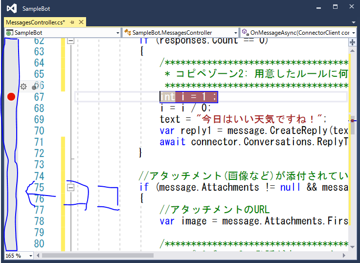
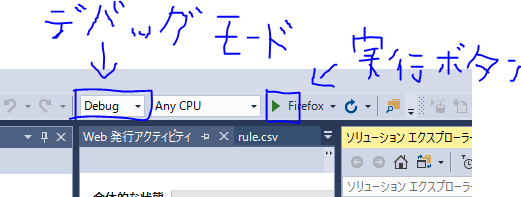
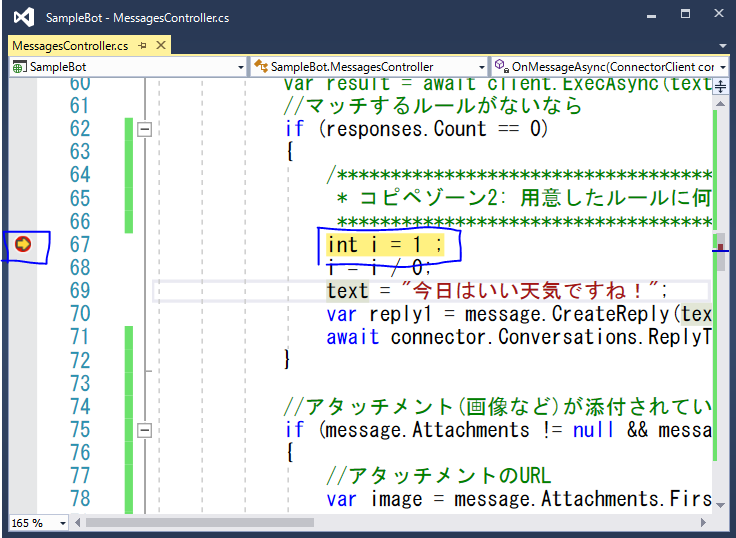
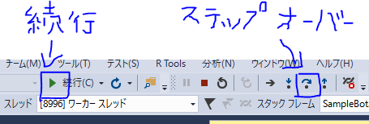
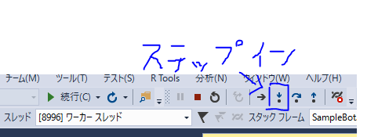
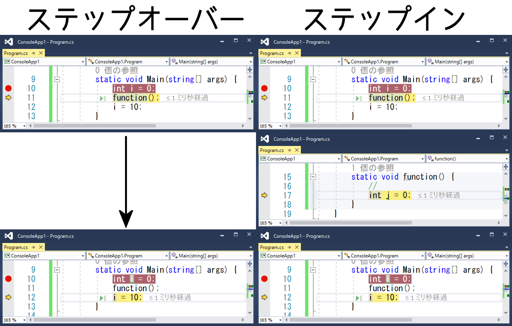
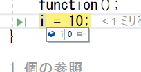
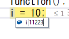

# トラブルシューティング(C#)

BotFrameworkはいろいろな技術を使ってるのでよくわからない原因でうまく動かないことがよくあります。

そういうときのトラブルシューティング方法をご紹介します。

## Visual Studioでステップ実行

Visual Studio は**ブレークポイント**を配置し**ステップ実行**ができます。

ブレークポイントを配置した行が実行される前にプログラムが中断し、**その時点での変数の値を確認、変更できます**。

また、プログラム中断後**1行1行中断しながら実行**することができます（ステップ実行）

### 手順
まずプログラムを中断させたい行番号の左隣のグレーゾーンをクリックし、赤い●をつけます。

この状態でデバッグモードになっていることを確認して実行します。

次にプログラムの実行を進めブレークポイントに引っかかるのを待ちます。

（Botの応答処理の部分にブレークポイントをおいた場合はBotframework Emulator上でチャットを書き込めば実行されると思います）

ブレークポイントをおいた行が実行される前になると図のようにブレークポイントのマークが変わり、該当する行がハイライトされます。

この状態で「続行」ボタンを押せば次のブレークポイントまで、「ステップオーバー」ボタンを押せば次の行が実行されます。

また、関数の中に入りたい場合は「ステップイン」ボタンを押してください。

「ステップイン」と「ステップオーバー」の違い

中断中に変数を見たい場合は変数名の上にマウスカーソルをおいてください。

変数に格納されている値を確認できます。

また、値をダブルクリックすると編集することができます。

