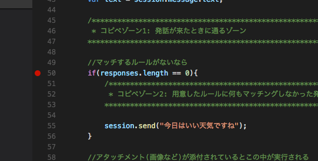
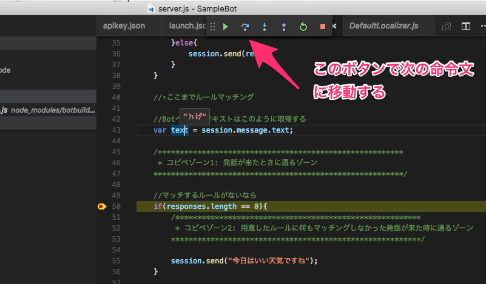
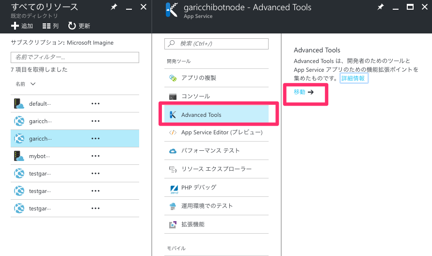
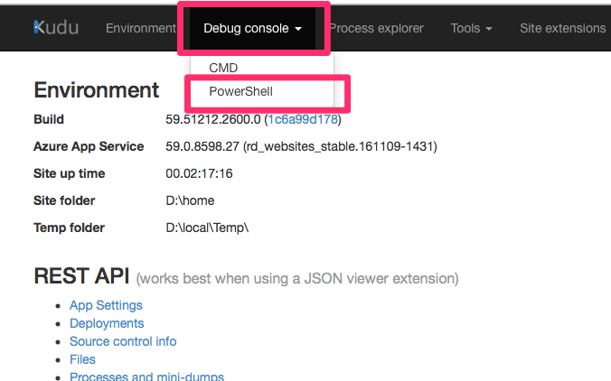
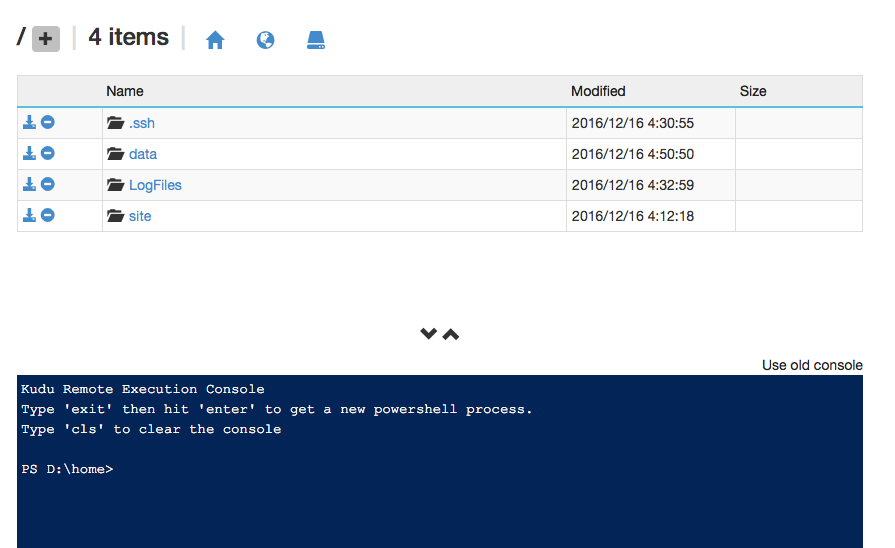

# トラブルシューティング(node.js)

BotFrameworkはいろいろな技術を使ってるのでよくわからない原因でうまく動かないことがよくあります。

そういうときのトラブルシューティング方法をご紹介します。

## VSCodeでステップ実行
VisualStudioCodeはnode.jsのプログラムの**ブレークポイントによるステップ実行**ができます。

**ブレークポイントによるステップ実行**で何ができるかというと、**プログラムを任意の行で止めて、その時点での変数の値などを確認**できます。

やり方としては、プログラムを止めたい行の行番号の左側をクリックして、赤い●をつけます。

この状態でF5キーなどでデバッグを開始するとその行でプログラムが停止し、その時点での変数の値を確認できます。

また、上にあるツールバーから下図のボタンを押すことで次の命令にプログラムをすすめることができます。

ブレークを止めたい場合は、もう一度赤いボタンを押すと、ブレークしなくなります。

## サーバーのログを確認する

今回のWebサーバーであるWebAppは特殊な操作をすることでサーバーの中身を見ることができます。

WebAppの管理画面から、[Advanced Tools]>[移動]を押します。

[Debug console]>[PowerShell]を選択し

このような画面がでるので、[LoFiles]>[Application]をクリックし、[logging-error.txt]の中身を見ます。

このファイルの中に、node.jsのエラーが出力されているのでエラーの原因をとくていすることができます。