# Bot作成(node.js編)チュートリアル
## 1. 注意事項
このチュートリアルを行うには以下の環境が必要になります。
- MacOSX or Linux PC
- node.js環境、npm環境
- VisualStudioCode(node.jsが開発できる環境ならなんでもいいですがオススメ)
- Microsoft Imagineのライセンス
- Microsoft Azureの環境
- Dropbox、OneDrive、Githubのどれかのアカウント

まだ準備ができていない人はスタッフまで声をかけてください。

このチュートリアルには

- **学習価値のある一般技術知識**
- **ハッカソンでしか使えない技術知識**

の2つの情報が含まれています。

**学習価値のある一般技術知識**  は一般的に通用しているMicrosoftの技術知識です。ほかに応用が利くのでハッカソンを通して学習してもらえればと思います。

**ハッカソンでしか使えない技術知識**  今回、ハッカソンでアイデアを実現するために様々なライブラリや環境を用意しています。なのでこの知識は覚える必要はありません。ハッカソンで使ってあとは忘れてください。

## 2. セットアップ
### 2.1 プロジェクトを開く

VisualStudioCodeを起動し、[ファイル]>[開く]から、ダウンロードした201612hackathonyokohama/nodejs/SampleBotフォルダを開きます。

server.jsが左のリストに出ている状態にしてください。

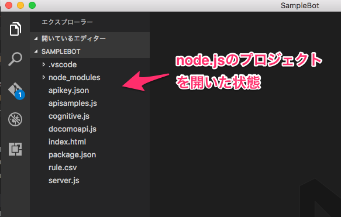

このプロジェクトに入っているプログラムは下記の用になっています。

- **apikey.json**: WebAPIのAPIキーを入れるファイル(後で作成するので今は存在しません)
- **cognitive.js**: cognitive serviceのnode.jsライブラリ実装
- **docomoapi.js**: docomoAPIのnode.jsライブラリ実装
- **index.html**: Botのサーバーにアクセスしたときに表示されるhtml
- **package.json**: node.jsに必要なパッケージの情報が入っているファイル
- **rule.csv**: Botの応答ルールを記述できるcsvファイル
- **server.js**: Botのメインサーバープログラム

つまり、主に見るべきファイルは**server.js**です。

ダウンロードした状態では、node.jsのパッケージに足りないものが存在するので、package.jsonにある情報からパッケージを復元します。

VisualStudioCodeのメニューバーから、[表示]>[統合ターミナル]を表示します。

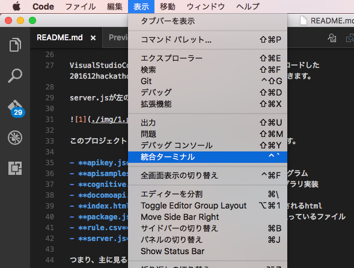

ターミナルを表示することができます。

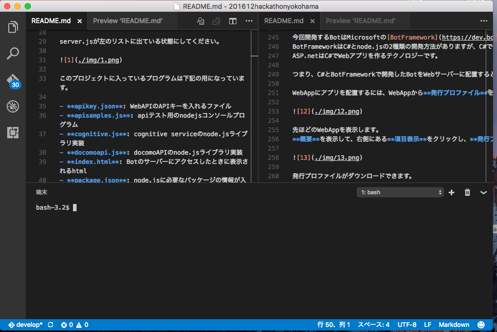

では以下のコマンドターミナルに打ち込んで、nodeパッケージを復元します。

pwdコマンドを使用して現在のカレントディレクトリがnodejs/SampleBotにあることを確認します。(もし違う場合はcdで移動してください)

```sh
bash-3.2$ pwd
{ダウンロードしたディレクトリ}/201612hackathonyokohama/nodejs/SampleBot
```

npm installコマンドでパッケージを復元します。

```sh
bash-3.2$ npm install
```

エラーが出なければokです。

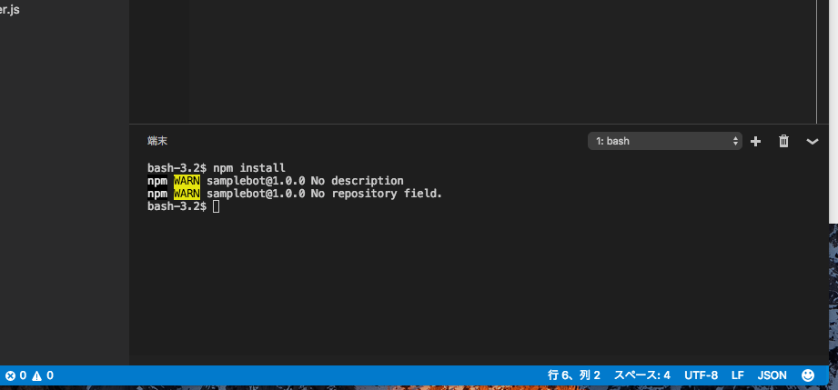

これで足りないnodeパッケージを復元できました。

### 2.2 Botのサーバーを作る
**学習価値のある一般技術知識**

Botはサーバー上で動くため、ホスティングするサーバーを立てなければなりません。
今回はMicrosoft Azureというクラウド上に、学生ライセンスを使って無料でホスティングを行います。

[http://portal.azure.com](http://portal.azure.com)にアクセスし、**MicrosoftImagineで学生認証を行ったMicrosoftアカウントでサインイン**します。

以下のような画面が表示されればOKです。

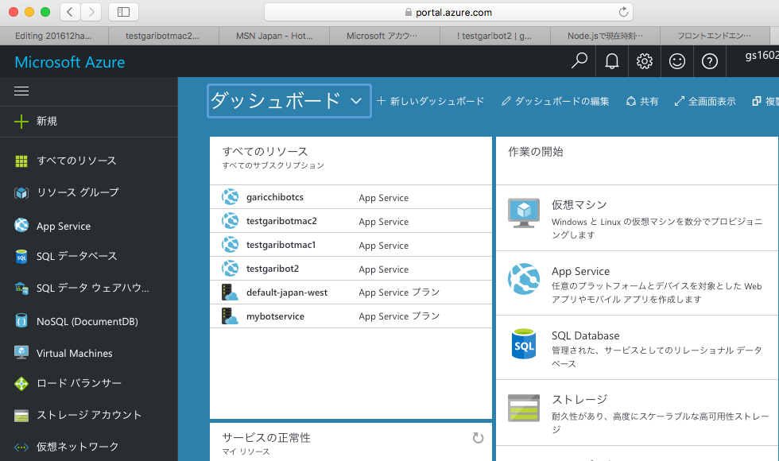

Webサーバーを作ります。Microsoft AzureではWebサーバーなどの資源は**リソース**として管理されます。
そしてMicrosoft AzureのWebサーバーは**Web App**というリソースになります。
Web Appを新規作成しましょう。

左上の**+新規**>**Web+モバイル**>**Web App**を選択します。

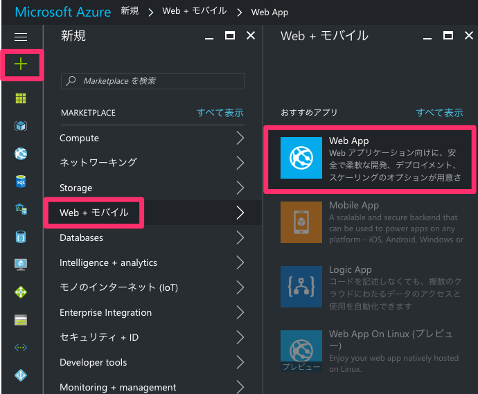

下図のような画面が出るので

- アプリ名 - お好きなIDを入力
- サブスクリプション - Microsoft Imagine(もしくはDream Spark)を選択
- リソースグループ - 新規作成、**MyBotGroup**と入力
- App Serviceプラン/場所 - 後述

を入力します。

アプリ名は他人と被らないものを入力してください。右側に緑色のチェックマークが表示されればOKです。

アプリ名.azurewebsites.netがBotのURLとなります。

サブスクリプションの選択で**Microsoft Imagine(もしくはDream Spark)**が表示されない方は学生認証の準備をしていない可能性があります。速やかに手を挙げてスタッフを呼んでください。

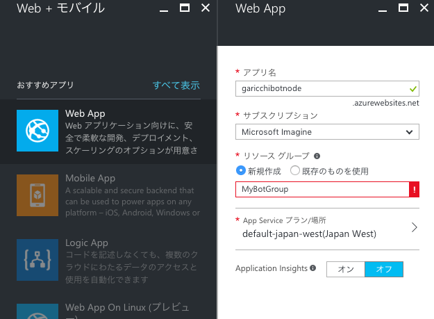

**App Serviceプラン 場所**をクリックすると下図のようになります。**新規作成**を押し

- App Service プラン - お好きなIDを入力
- 場所 - Japan Eastを選択
- 価格レベル - F1 Freeを選択

を入力し、OKを押します。

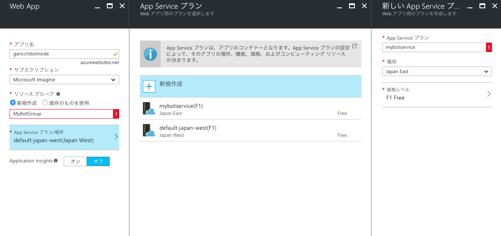

ここまでできたら**作成**を押します。

右上のベルマークに**デプロイメントが成功しました**と表示されればOKです。

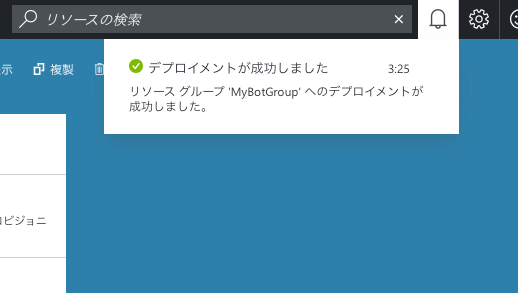

作成したWebサイトを見てみましょう。
左側の**すべてのリソース**から先ほど作成したIDをクリックします。

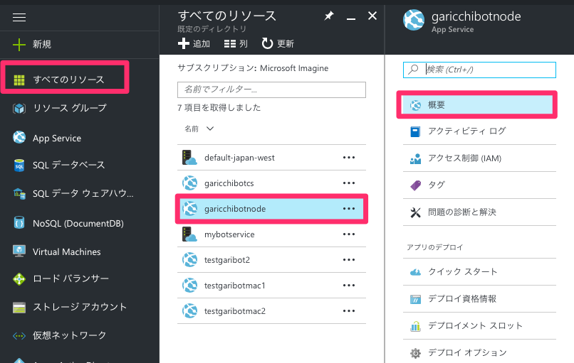

先ほど作成したWebAppの管理画面が表示されます。
URLが表示されているのでURLをクリックします。

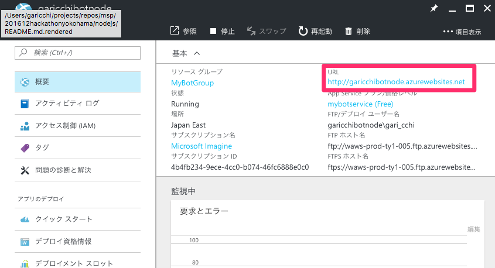

Webサイトを表示することができました。
デフォルトで用意されているページが表示されているはずです。

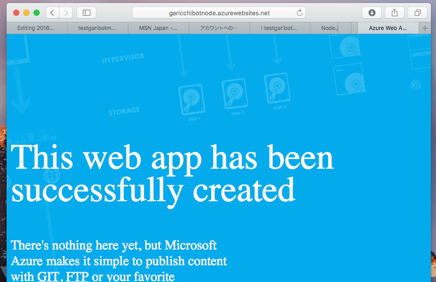

続いてWebAppsのnode.jsのバージョンを上げましょう。デフォルトでは4.4.7とバージョンが古いので、新しいバージョンにする必要があります。

作成したWebAppの管理画面から[アプリケーション設定]を押します。

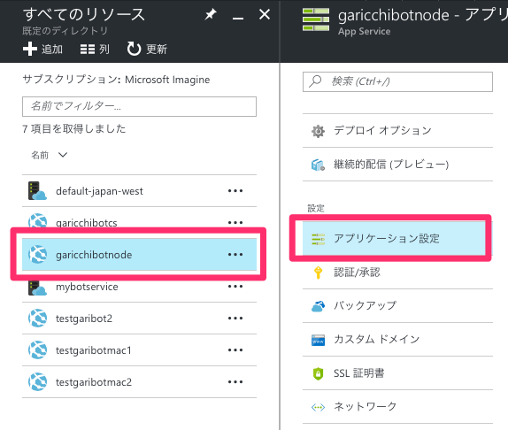

アプリケーション設定の画面を下の方にスクロールすると、[アプリ設定]という項目に[WEBSITE_NODE_DEFAULT_VERSION]というキーがあります。そこの値を**7.2.0**に書き換えます。書き換えることができたら、左上の[保存]ボタンをおします。

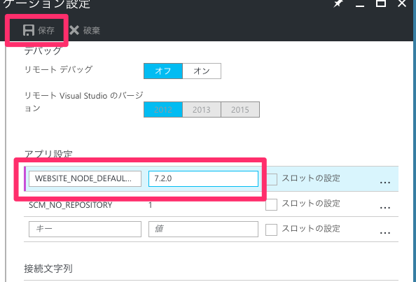

これでWebAppのnode.jsのバージョンをアップグレードできました。

### 2.3 BotをBot Connectorに新規登録する
**学習価値のある一般技術知識**

Microsoft BotFrameworkでは[Bot Connector](http://www.atmarkit.co.jp/ait/articles/1604/15/news032.html)というものを利用して、自分のBotを配置したWebサーバーとslackやSkypeなどのメッセンジャーサービスをつなげることができます。

なのでBotをメッセンジャーサービスにつなげるには、必ずBot Connectorに登録しなければいけません。


[BotFrameworkの公式サイト](https://dev.botframework.com)にアクセスします。

**Register a bot**をクリックします。

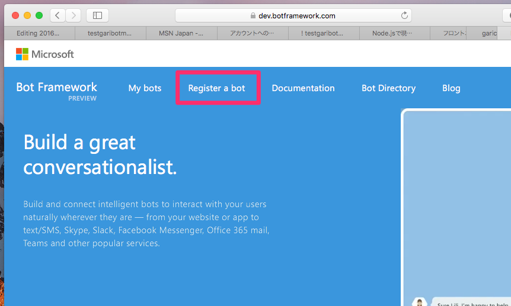

Microsoftのアカウントでのサインインを求められた場合、ご自身のMicrosoftアカウントでサインインしてください。

Botの新規登録ページが出てきたら下記の情報を入力してください。

- **Icon**:Botのアイコンになります。好きなアイコンにしたければ30K以下のpngファイルを指定してください。特に気にならなければ何も指定しなくてOK
- **Name**: Botの名前。好きな名前をどうぞ
- **Bot handle**:BotのIDになります。他と被らない好きなIDを入れます。
- **Description**:詳細説明。テキトーなことを書いてOK

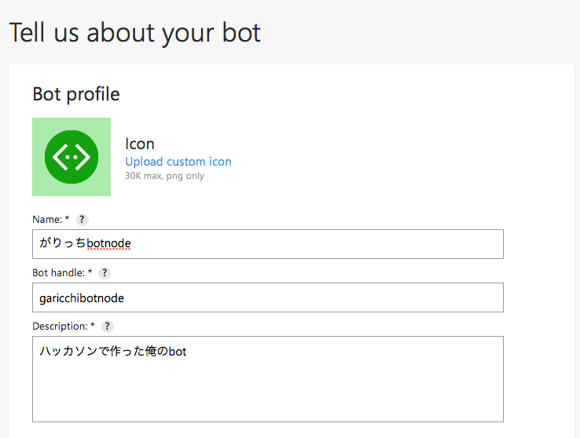

- **Messaging endpoint**:Botを配置したWebAppのURL。

```
https://{webappのID}.azurewebsites.net/api/messages

```

を入力(↑**httpsなところに注意！**)

できたら**Create Microsoft App ID and password**ボタンを押します。

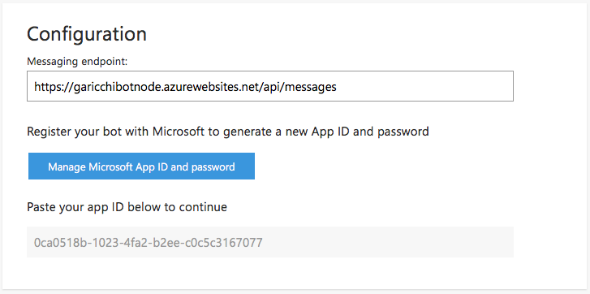

新しくタブが開くと、すでにアプリ名とアプリIDが入力されていると思います。

**アプリIDをどこかにメモしてください**

**アプリパスワードを作成して続行**ボタンを押します。

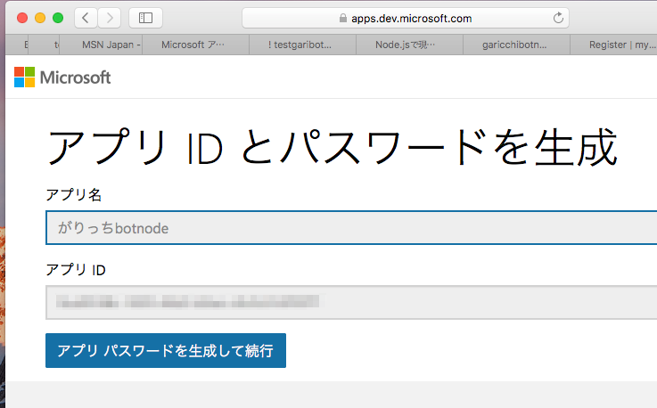

新しくパスワードが作成されましたという表示の元、Botのアプリパスワードが表示されます。

**このパスワードは1回しか表示されないのでかならずどこかにメモしてください**

(パスワードを忘れた場合再発行になります)

**OK**をおしてダイアログを閉じます

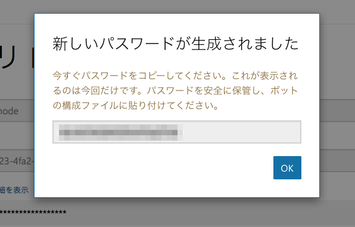

**終了してボットのフレームワークに戻る**を押します。

戻ると、アプリIDが入力されています。入力されていない場合はメモしたアプリIDを入力してください。

Adminの項目は何も入力しなくてもOKです。

一番下の**By clicking Register ～**の部分にチェックをいれ、**Register**ボタンを押してBotを新規登録します。

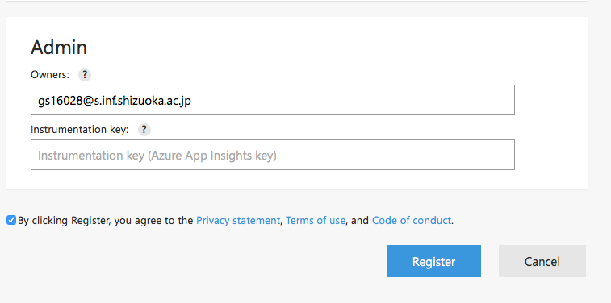

**Bot created**と表示されればOKです。**OK**ボタンをおします。

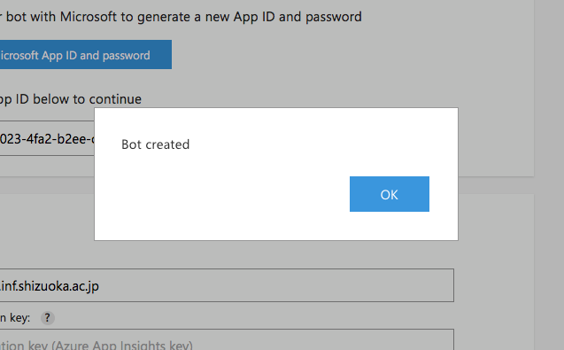

BotをBot Connectorに新規登録できました。

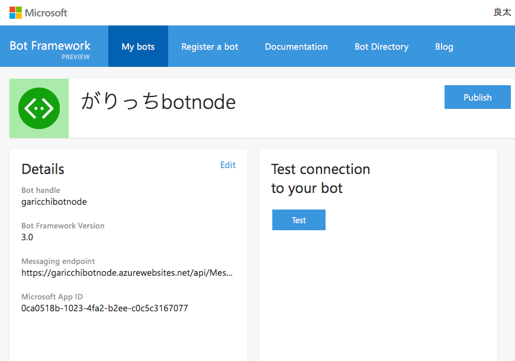

この時点で

- BotのMicrosoft App Id
- BotのMicrosoft App password

がどこかにメモできているでしょうか。
メモできていなければ、上の手順を読み直して、Botを再度作成してください。

### 2.4 BotのIDとパスワードをBotのプログラムに入れる
**ハッカソンでしか使えない技術知識**

Botを動かすためには、先ほど取得したBotのIDとpasswordを開発しているBotのプログラムに入力する必要があります。

今回はapikey.jsonというファイルにBotのIDとパスワードを入れると、自動で読み込むようなプログラムを作っておきました。
なので、apikey.jsonを編集すればIDとパスワードを読み込むことができます。

apikey.jsonというファイルはまだないのでnodejs/SampleBotのフォルダの以下に**apikey.json**ファイルを新規作成します。

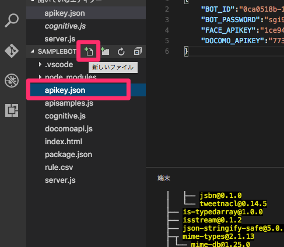

apikey.jsonファイルの中身を以下のようにします。

```json
{
    "BOT_ID":"",
    "BOT_PASSWORD":"",
    "FACE_APIKEY":"",
    "EMOTION_APIKEY":"",
    "COMPUTER_VISION_APIKEY":"",
    "BING_SEARCH_APIKEY":"",
    "DOCOMO_APIKEY":""
}
```

**BOT_ID**には先程メモしたBotのMicrosoft App IDを、**BOT_PASSWORD**には先程メモしたBotのMicrosoft App Passwordを入れてください。

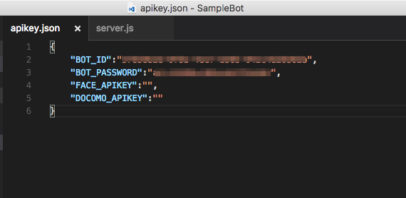

### 2.5 その他のWebAPIKeyを入れる
**ハッカソンでしか使えない技術知識**

ダウンロードしたSampleBotプロジェクトは、今回ハッカソンで使用する各種WebAPIのAPIKeyが入っていないため、ビルド(プログラムを実行ファイルにすること)ができません。

そこでまずはWebAPIのApiKeyを入力しましょう。

その他のWebAPIKeyも、先程と同じapikey.jsonファイルに書き込みます

各種APIKeyはスタッフから指示があるまでお待ちください。

このようにAPIKeyが埋まればOKです。

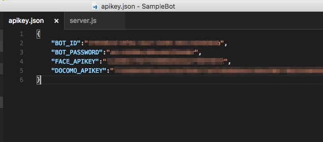

### 2.6 Botをサーバーに配置する
**学習価値のある一般技術知識**

今回開発するBotはMicrosoftの[BotFramework](https://dev.botframework.com/)というものを使用して開発します。
BotFrameworkはC#とnode.jsの2種類の開発方法がありますが、node.jsでの開発の場合、node.jsのサーバーを起動し、それをBotサーバーとして利用することとなります。

なのでnode.jsでのBot開発の場合は、node.jsのサーバーを起動することと同じ操作で、Botサーバーを起動することができます。

先程Microsoft Azureで作成したWebAppは、node.jsも公式でサポートしており、配置されたファイルの中にあるserver.jsファイルを自動でnode.jsのサーバーとして起動してくれます。

なので今回の場合、server.jsファイルを含め、**SampleBotフォルダの中にある全てのファイルをWebApp上に配置**することでBotサーバーを起動できます。

ではどうやってnode.jsのプログラムをWebAppsに配置するかですが、WebAppsでは**Dropboxなどのクラウドストレージを利用してWebアプリをサーバーに配置**することができます。

では実際に配置していきましょう。

Azureの管理ポータル([portal.azure.com](http://portal.azure.com))に戻り、先程作成したWebAppの管理画面を表示し、[デプロイ オプション]を選択します。

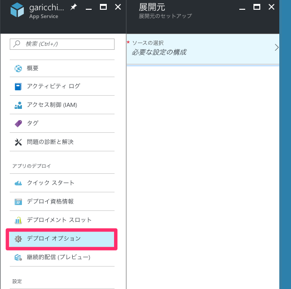

[ソースの選択]を選択します。
様々なサービスが出ますが、Dropbox、OneDrive、GitHubの中で自分の使っているサービスを選択してください。（できれば同期クライアントアプリをいれていること）

今回はDropboxで解説をしますが、基本的な操作はほかも同じです。

では[Dropbox]を選択します。

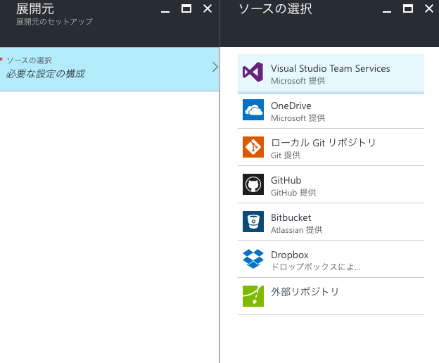

Dropboxのアカウント認証が入るので、アカウント認証をしましょう。

すると下図のような画面になるので[OK]を押します。

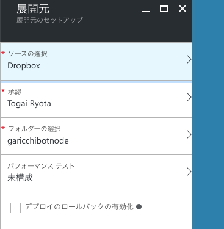

右上のベルマークに[デプロイ元は正常にセットアップされました]と表示されたらOKです。

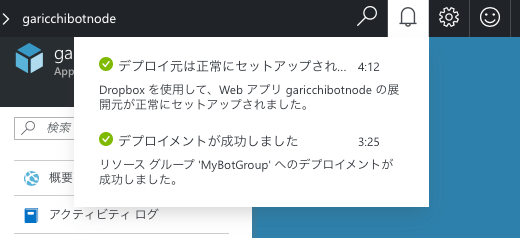

すると、Dropboxのルートフォルダ/アプリ/Azure/{自分のWebAppのID}のフォルダが作成されているはずです。

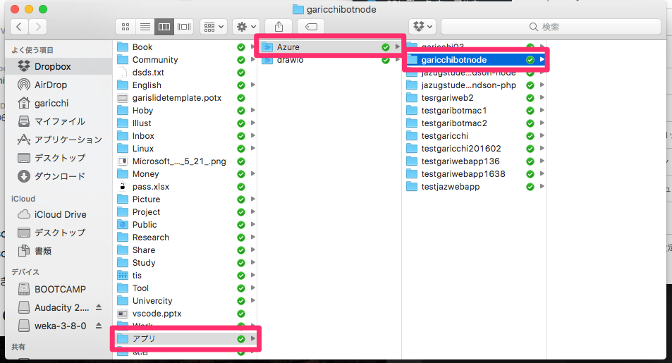

ここに、**node_moduleフォルダ**以外のnode/SampleBotにあるファイルをコピーします。

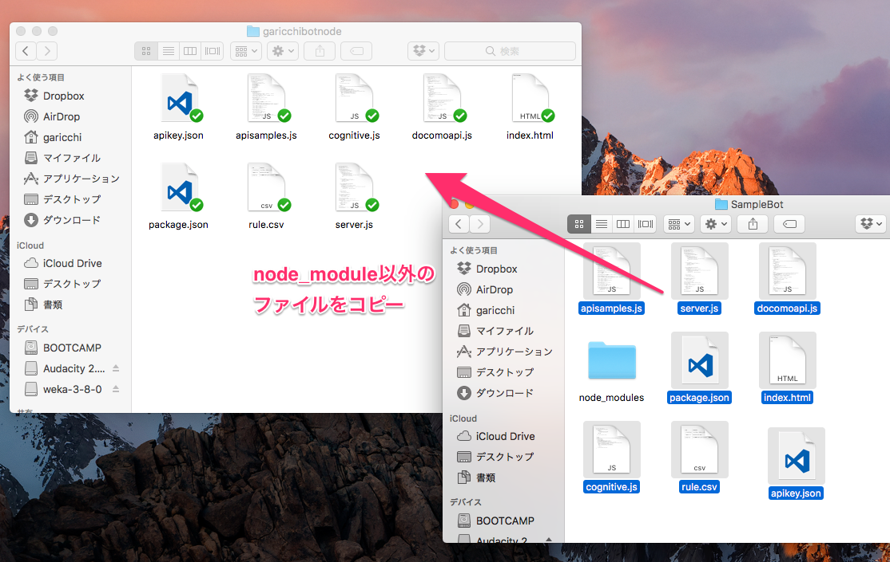

ファイルが同期されたら、再びWebAppの管理画面(Azure)へ戻り、[デプロイオプション]>[同期]>[はい]を押します。

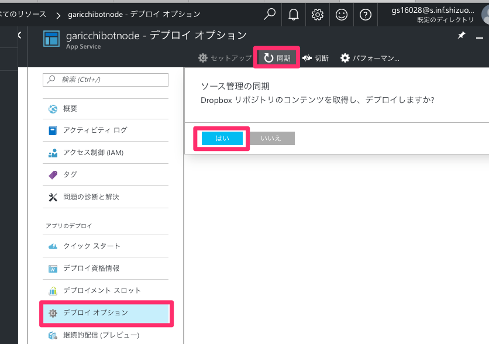

しばらく待つと、Synchronizedと表示され、DropboxのフォルダからWebAppへの配置が始まります。(ボタンを押してもなかなか始まらない場合は何回か押して見るのがよいかもです)

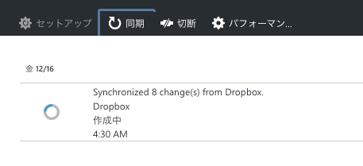

Synchronizedの表示が緑色のチェックマークになったら、配置完了です。

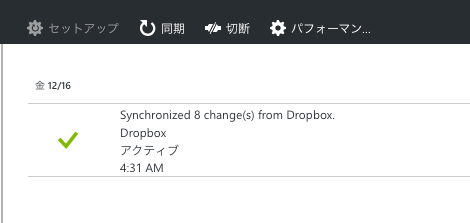

概要からURLを選択し、配置したページを開きます。

This is the bot pageと表示されたページが表示されればOKです。

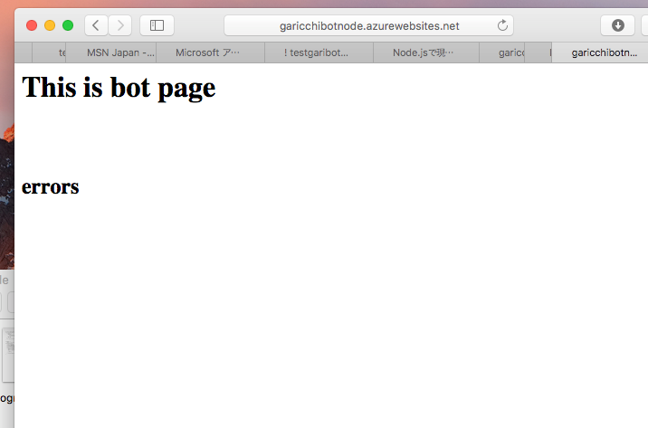

このようにDropboxにファイルを入れて、ボタン1つでWebアプリをサーバーに配置する機能がWebAppにはあります。

もし、Botのプログラムを変更した場合、もう一度上記の操作を行って配置をし直す必要があります。

### 2.7 Botと対話してみる
**学習価値のある一般技術知識**

ここまでで、ついにBotをサーバーに配置し、対話できる状態になりました。
では実際に対話してみましょう。

再び[dev.botframework.com](https://dev.botframework.com/)にアクセスします。

自分が先ほど作成したBotを表示するために**My bots**をクリックします。

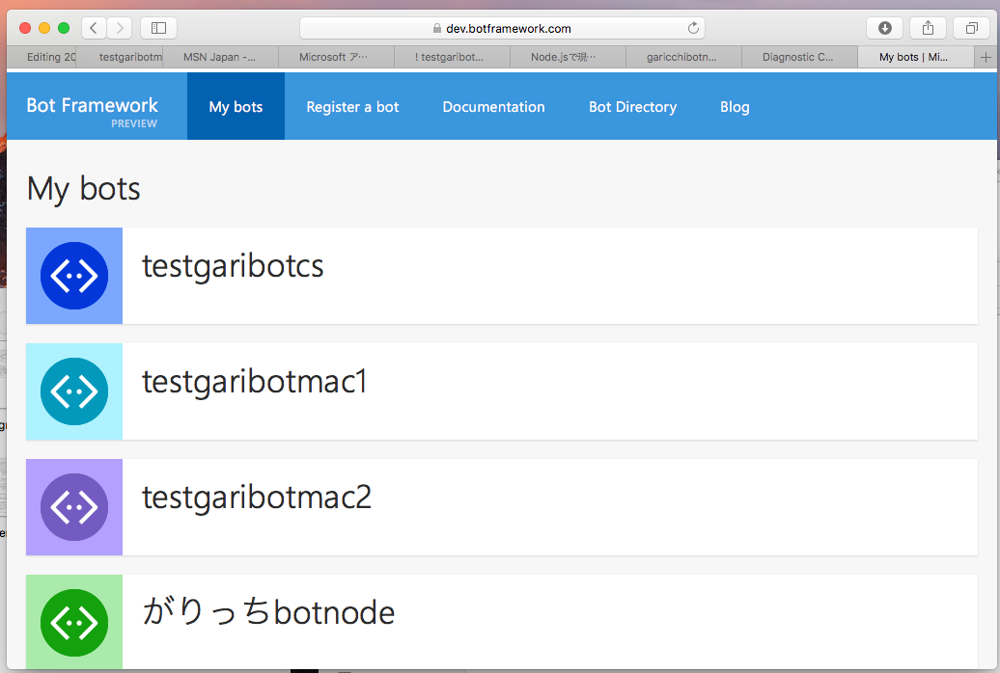

先ほど作成したBotの名前をクリックします。

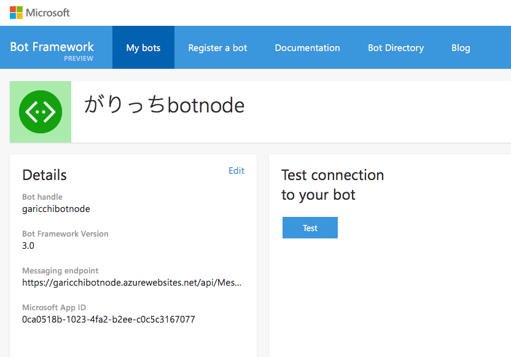

[Test]ボタンを押しみましょう。Acceptedと表示されたらテストOKです。Botサーバーと正しくつながっています。
Acceptedと表示されない場合は今までの手順に不具合があるのでスタッフをよんでください。

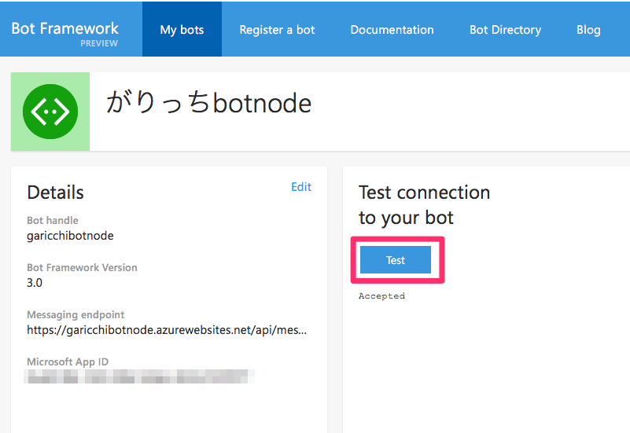

下にスクロールしていくと、チャットのテストをすることができます。
テキトーに入力して反応を見ましょう。
**こんにちは**と入力すると違った反応が見えると思います。

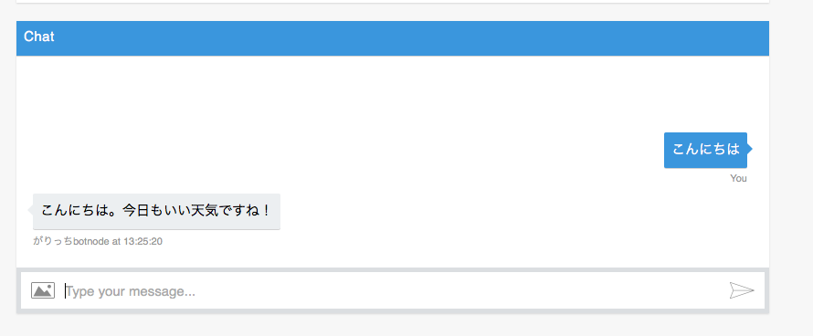

### 2.8 Slackと連携する
**学習価値のある一般技術知識**

Botの準備はできたのでメッセンジャーアプリと連携してみましょう。
今回はいろんな都合により、slackを使いたいと思います。

slackのアカウントを持っていない人は、[https://slack.com/create](https://slack.com/create)にアクセスし、アカウントを新規作成してください。
基本的にはサイトに沿ってアカウントを作ることができるとは思いますがわからない場合はスタッフに声をかけてください。

また、Botを配置できるチームを持っていない方は[https://slack.com/](https://slack.com/)で新しいチームを作成してください。
（今回のテスト用に個人用のチームを作成することをおすすめします。）

slackのアカウントを作成することができたら、作成したBotのページにアクセスします。

下の方にスクロールすると、Slackのアイコンがあるので**Add**というところを押します。


slackの設定ページが表示されます。

最初の**Login to Slack～**をクリックして展開し、中にあるリンクをクリックします。

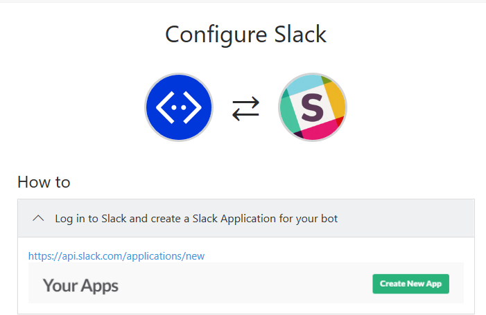

右上の**Create New App**ボタンをクリックします。

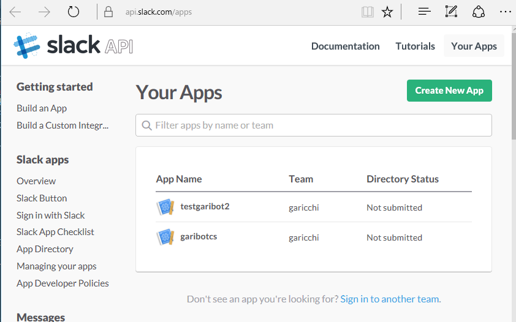

App Nameには英語で好きな名前を指定してください。Slack BotのIDになります。
Development Slack TeamはデフォルトのままでOKです。

**Create App**ボタンをクリックします。


左のリストから、**OAth&Permissions**を選択し、**Redirect URL(s)**のところに、以下のURLを入力します。

```
https://slack.botframework.com
```

入力できたら、**Save Changes**ボタンを押します。


左側のリストから、**Bot Users**をクリックし、**Add a Bot User**ボタンを押します。

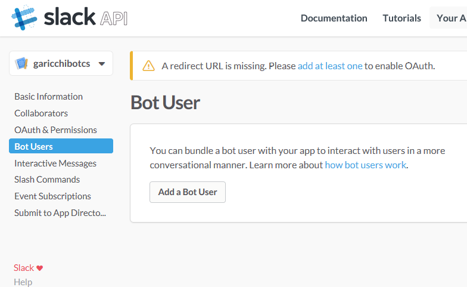

**Add Bot User**ボタンをクリックします。

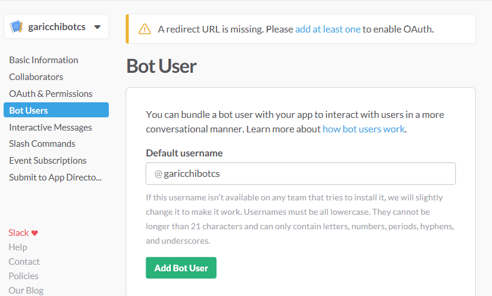

左側のリストから、**Basic Information**をクリックします。

表示された**Client ID**と**Client Secret(Showボタンを押したもの)**をどこかにメモしておいてください。

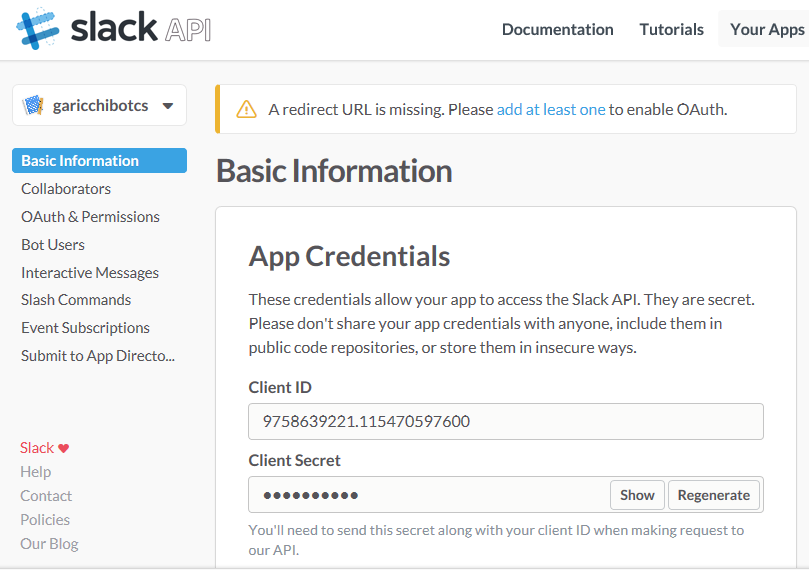

先ほどのBotとSlackの連携設定ページに戻り、**Submit your Credentials**を展開し、**Client Id**と**Client Secret**に先ほどコピーしたものを貼り付けます。

**Submit Slack Credentials**ボタンを押します。


**Autholize**をクリックします。


**Credentials have been validated**と表示されればOKです。

**I'm done configuring Slack**ボタンを押します。


以上でslackとBot Frameworkの連携が完了しました。

Slackを開くと、設定したBotがDirect Messageのところにいるので話すと、同じように会話することができます。


Slackはスマホアプリもあり、アプリをいれると、スマートフォンからも会話することができます。

## 3. Botの拡張
### 3.1 ローカルで開発をする
**ハッカソンでしか使えない技術知識**

先ほどまでで、BotのプログラムをWebサーバーに配置してBotと対話することができました。

しかし、Botのプログラムを変更するたびに、毎回Webサーバーに配置して確認->またプログラム変更みたいなことをしていると非常に効率が悪いです。

そこでBotFrameworkではエミュレーターを使用してWebサーバーに配置しなくても、Botがどういう応答をするのかを確認しながら開発することができます。

[BotFramework Emulator](https://docs.botframework.com/en-us/tools/bot-framework-emulator/)にアクセスします。

Get it hereのhereにあるリンクをクリックします。

botframework-emulatorというアプリケーションがダウンロードできるのでMacの**アプリケーション**フォルダに移動します。

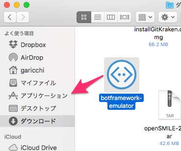

あとはMacのLaunchPadから見ると、エミュレーターが見えるので起動します。

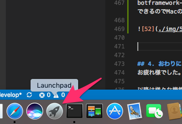

URLの欄には

```
http://localhost:3978/api/messages
```

と入力し、MicrosoftAppIDとMicrosoftAppPasswordはそれぞれapikey.jsonに書いたBOT_TDとBOT_PASSWORDを入力します。

入力できたら[OK]をおします。

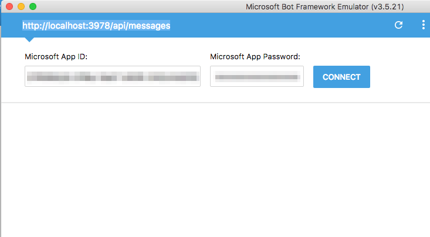

ローカルでBotのサーバーを起動するにはVisualStudioCodeのデバッグタブを開きます。(下図を参照)

デバッグタブを開いたら、**構成がありません**と上の方に表示されているので設定のアイコンをおします。(下図参照)

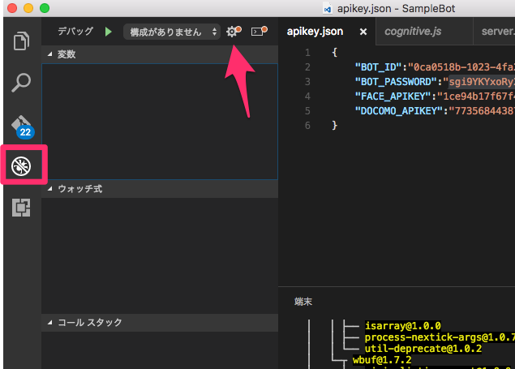

いくつか選択肢がでるので、**Node.js**を選択します。

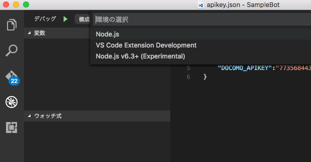

選択すると、**launch.json**というファイルがエディタで表示されます。
これがVSCodeでデバッグの設定をするためのものです。

気をつけることとしては、**program:**の項目の値が**"${workspaceRoot}/server.js"**になっているか注意してください。もし**"${workspaceRoot}/app.js"**になっている場合は**app.js**の部分を**server.js**に置き換えてください。

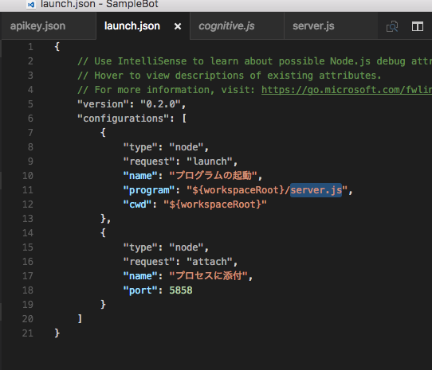

ここまでできたら、F5キーか、**緑の三角形**を押します。

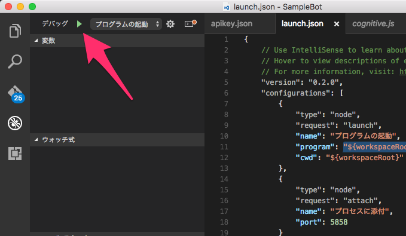

すると、このような画面になります。この状態で、ローカルの3978番ポートにnode.jsのサーバーを立ち上げることができました。

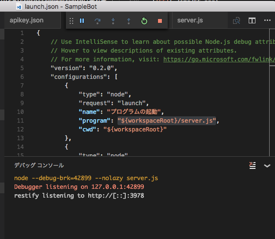

ではエミュレーターから発話をしてみましょう。
Botから応答が返ってくれば成功です。

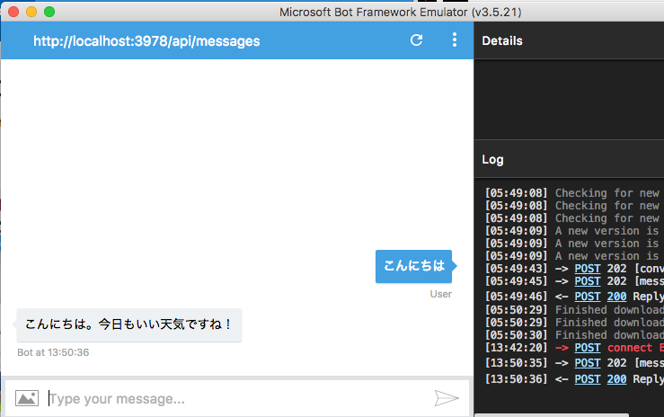

Botのサーバーを停止するには**赤い■ボタン**を押します。

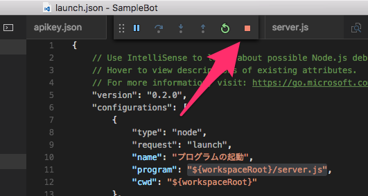

これで、Webサーバーに配置せずとも、ローカルでBotの開発ができるようになりました。

実際にBotをslackなどと対話させたい場合は、もう一度前の手順をつかってWebAppに配置しましょう。

### 3.2 ルールファイルを編集して応答ルールを変える
**ハッカソンでしか使えない技術知識**

今回スタッフが作成したSampleBotは、プログラムがかけなくても応答パターンを変更できるように、Botの応答ルールをcsvファイルとして記述することができます。

nodejs/SampleBotフォルダの中にある**rule.csv**ファイルを開きます。

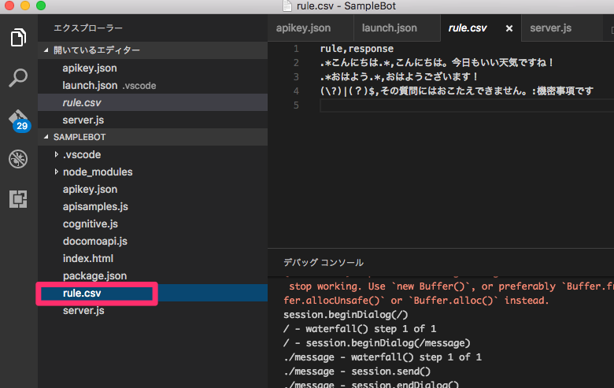

今回作成したcsvは下図のようなルールになっています。

ルールは

```
ルール(正規表現),応答発話
```
という風にcsvを記述していきます。

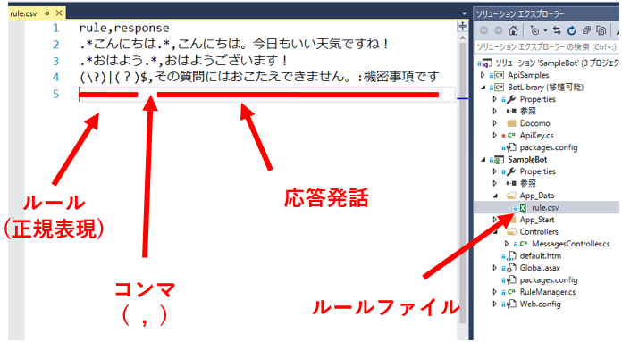

Botに発話が入力されると、左側に書いた正規表現のルールを検索し、マッチしたルールの右側にある応答文をBotが返してくれます。

例えば**おやすみ**というワードが発話に入っている時、**おやすみなさいませ**と応答させるなら、以下のようなルールを追加します。

```
.*おやすみ.*,おやすみなさいませ
```
発話中に**hoge**が入っているというルールは正規表現で以下のように書くことができます。
```
.*hoge.*
```

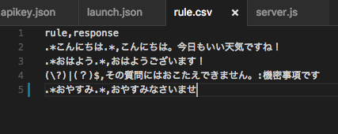

csvを変更したら、プログラムを実行してエミュレーターから**おやすみ**と入力してみましょう。

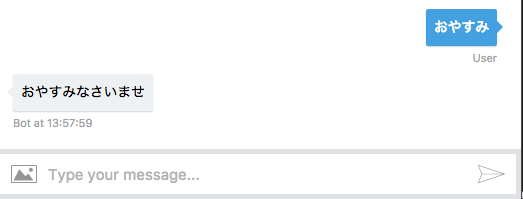

応答ルールを変えることができました。

あまりプログラムに自身がない人はこのcsvファイルを編集して、オリジナルな応答を行うBotを作りましょう。

### 3.3 プログラムで応答を変える
**ハッカソンでしか使えない技術知識**

応答ルールをcsvで記述するだけでなく、node.jsのプログラムを編集して応答ルールを変更することもできます。

**server.js**ファイルを開きます。

Botにメッセージが来ると、このファイルの中のOnMessage関数が呼び出されます。

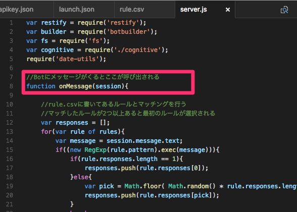

onMessage関数はsessionという引数を持っています。
このsessionにはBotに送られてきたメッセージの情報が入っています。

Botに送られてきたメッセージを取得するには以下の文を記述します。

```js
var text = session.message.text;
```

また、Botからメッセージを応答させたい場合は以下の文を記述します。

```js
var text = "今日はいい天気ですね";
session.send(text);
```

### 3.4 応答ルールファイルとプログラムを連携させる
**ハッカソンでしか使えない技術知識**

SampleBotでは、先ほど記述した応答ルールのcsvとnode.jsのプログラムを連携させることができます。

以下のように、応答に

```
{command1}
```
のように{　　}でくくったような応答を書くと、

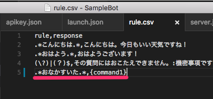

**server.js**ファイルの**onCommand**関数に{ }内の文字列が渡され、呼び出されます。(今回の場合はcommand1)

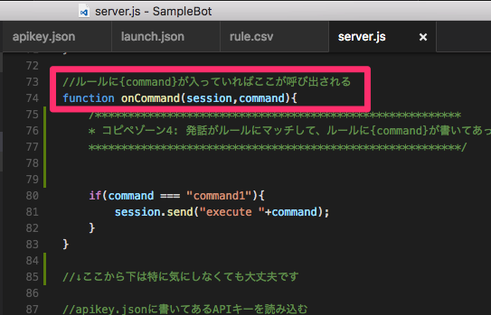

このように正規表現で記述した条件にマッチした場合、node.jsのプログラムでAPIを利用したりなどができます。

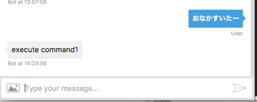

### 3.5 発話データを外部APIと連携する
**ハッカソンでしか使えない技術知識**

今回、よりすごい機能を簡単に実装できるように、コピーアンドペースト用のサンプルコード集を作りました。
サンプルコード集は[COPYCODE.md](./COPYCODE.md)にあります。

この中で、発話のテキストデータを解析するAPIを使用してみましょう。

例えば、docomoのAPIの場合、漢字をひらがなに変換することができます。
コピペ用コードはこのようになっていますが、下のコードの意味としては、hiragana関数の第一引数に入った文字列を、ひらがなに変換することができるコードです。

```js
//コピペゾーン1にコピペする
var text = 'あらゆる現実をすべて自分の方に捻じ曲げたのだ';
var result = '';
docomo.hiragana(text, 'hiragana', function(r){
    result = r;
});
```
コピペ用コードには説明のところに**コピペゾーン**が指定されています。コピペゾーンとはソースコードにコメントとして書いてあるコピペゾーンのことです。

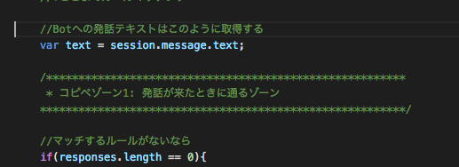

今回はコピペゾーン1が指定されているのでコピペゾーン1の下にコピペしましょう。
今回の場合、resultには発話がひらがなに変換された文字列が入っています。

このように、サンプルコード集は[COPYCODE.md](./COPYCODE.md)を見て、指定されたところにコピペするだけで、Botの機能を拡張することができます。

### 3.6 画像データを外部APIと連携する
**ハッカソンでしか使えない技術知識**

今回のBotは、添付された画像データも利用することができます。
例えばサンプルコード集[COPYCODE.md](./COPYCODE.md)にある、Cognitive ServiceのFace APIを用いると添付された画像にうつった顔が何歳か判定することができます。

画像データの場合、**コピペゾーン3**に主にコピペすることになります。

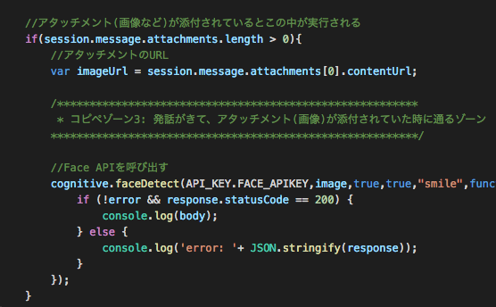

今回はすでに以下のようなプログラムが書かれていると思います。

```js
//Face APIを呼び出す
cognitive.faceDetect(API_KEY.FACE_APIKEY,image,true,true,"age",function(error,response,body){
    if (!error && response.statusCode == 200) {
        session.send(body[0].faceAttributes.age+'歳');
    } else {
        session.send('error: '+ JSON.stringify(response));
    }
});
```

このプログラムは添付ファイルのURLを取得し、顔が写っているなら何歳か判定するプログラムとなっています。

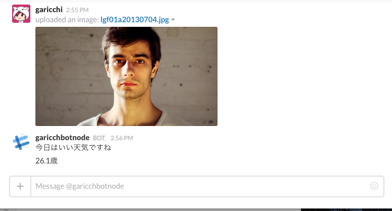

**重要1:画像ファイルの使用はslackかWebChatでしか使用できません**

つまりエミュレータでのローカルデバッグでは画像の取得はできないということを注意してください。

**重要2:同じファイル名の画像ファイルは2回連続で添付できません**

ファイル名を変えるか、画像を変えて添付しましょう。

### 3.7 練習
**ハッカソンでしか使えない技術知識**

サンプルコード集[COPYCODE.md](./COPYCODE.md)には様々な機能がコピペできる状態で存在しています。

**今現在、Botに添付ファイルが来ると年齢認識するプログラムが書かれていますが、年齢認識ではなく、感情判定できるBotを作ってみてください**

機能の実装練習なので、わからなければ即座に手を挙げて、スタッフを呼んでください


## 4. おわりに
お疲れ様でした。チュートリアルは以上となります。

以降は様々な機能を駆使して、オリジナルなBotのアイデアを実現していきましょう。

### 4.1 あまりプログラミングが得意ではない人
基本的にはrule.csvファイルのルールを編集するだけでBotの応答ルールは変えることができます。まずはそこから初めて、Botにどういう応答をしてほしいかを考えながら進めていきましょう。プログラムと連携したいときはスタッフを呼んでください。

### 4.2 プログラミングがそこそこ得意な人
command機能やcognitive service、docomoのAPIなどを駆使して面白いアイデアを実現していきましょう。コピペでエラーなどが出たらスタッフを呼んでいただければ対処します。サンプルコード集はこちらです。[COPYCODE.md](./COPYCODE.md)

### 4.3 プログミングが得意な人
オリジナルなアイデアで賞をめざしてください！余裕があれば、周りで困っている人を助けてもらうとうれしいです。
